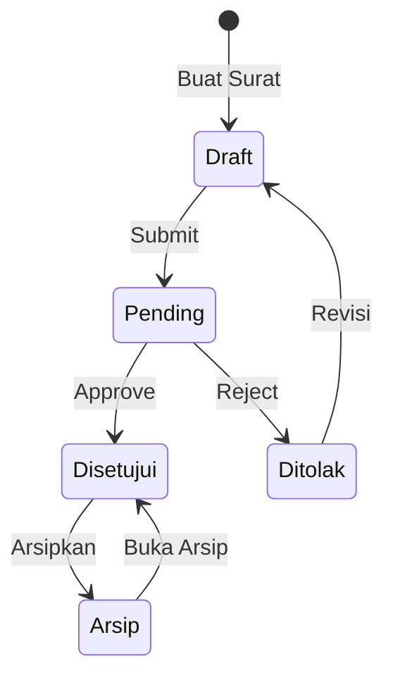
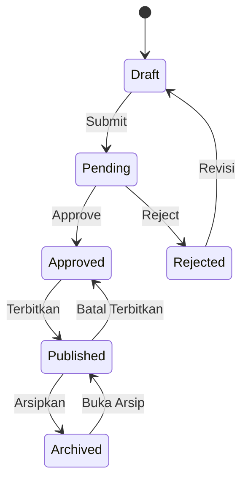

# Surat Siega - Product Specification

> **Versi**: 1.0  
> **Tanggal Dokumen**: 9 Februari 2026  
> **Status**: Active Development

---

## 1. Overview

**Surat Siega** adalah Sistem Manajemen Surat berbasis web yang dibangun untuk mengelola surat-surat resmi institusi pendidikan. Sistem ini mencakup pembuatan, persetujuan, penandatanganan digital, dan pengarsipan surat secara terintegrasi.

### 1.1 Tujuan Aplikasi

- Digitalisasi proses pembuatan dan pengelolaan surat resmi
- Workflow persetujuan bertingkat dengan notifikasi real-time
- Penandatanganan digital dengan dukungan tanda tangan dan cap
- Arsip digital dengan pencarian dan ekspor data

### 1.2 Target Pengguna

| Role            | Deskripsi                                                          |
| --------------- | ------------------------------------------------------------------ |
| **Admin TU**    | Administrator Tata Usaha - mengelola master data, user, dan sistem |
| **Dekan**       | Pimpinan tertinggi - approval dan penandatanganan surat            |
| **Wakil Dekan** | Pimpinan - approval dan penandatanganan surat tertentu             |
| **Staff**       | Pembuat surat - dosen dan tenaga kependidikan                      |

---

## 2. Technology Stack

### 2.1 Backend

| Komponen           | Teknologi          | Keterangan                        |
| ------------------ | ------------------ | --------------------------------- |
| **Framework**      | Laravel 10.x       | PHP 8.1+                          |
| **Database**       | MySQL 8.0          | InnoDB Engine                     |
| **Authentication** | Laravel Auth       | Session-based dengan guard custom |
| **Authorization**  | Laravel Policies   | Role-based access control         |
| **Queue System**   | Laravel Jobs       | Untuk email notifications         |
| **PDF Generation** | Snappy/wkhtmltopdf | Konversi HTML ke PDF              |

### 2.2 Frontend

| Komponen            | Teknologi              | Keterangan             |
| ------------------- | ---------------------- | ---------------------- |
| **Template Engine** | Blade                  | Laravel's templating   |
| **CSS Framework**   | Custom CSS             | Dengan komponen modern |
| **JavaScript**      | Vanilla JS + Alpine.js | Interaktivitas         |
| **Build Tool**      | Vite                   | Asset bundling         |
| **Icons**           | HugeIcons              | Icon library           |
| **UI Components**   | Flowbite               | Modal, dropdown, dll   |

---

## 3. Core Modules

### 3.1 Surat Tugas (Assignment Letter)

Modul untuk mengelola Surat Tugas yang ditujukan kepada dosen, tenaga kependidikan, atau mahasiswa.

#### 3.1.1 Data Model: `TugasHeader`

```
tugas_header
├── id (PK, auto-increment)
├── nomor (unique, format: ###)
├── suffix (char, A-Z untuk nomor turunan)
├── parent_tugas_id (FK ke tugas induk)
├── nomor_urut_int (sorting)
├── status_surat (enum: draft|pending|disetujui|ditolak|arsip)
├── tanggal_surat (date)
├── jenis_tugas (varchar)
├── tugas (varchar, required)
├── detail_tugas (text)
├── waktu_mulai (datetime)
├── waktu_selesai (datetime)
├── tempat (varchar)
├── redaksi_pembuka (text)
├── penutup (varchar)
├── tembusan (text)
├── status_penerima (enum: dosen|tendik|mahasiswa)
├── nama_umum (varchar)
├── dibuat_oleh (FK → pengguna)
├── asal_surat (FK → pengguna)
├── penandatangan (FK → pengguna)
├── next_approver (FK → pengguna)
├── klasifikasi_surat_id (FK → klasifikasi_surat)
├── ttd_config (JSON)
├── cap_config (JSON)
├── file_path (varchar, PDF path)
├── signed_pdf_path (varchar)
├── tanggal_arsip (timestamp)
├── arsipkan_oleh (FK → pengguna)
└── timestamps, soft_deletes
```

#### 3.1.2 Relasi Terkait

| Model                | Relasi            | Deskripsi                           |
| -------------------- | ----------------- | ----------------------------------- |
| `TugasPenerima`      | HasMany           | Daftar penerima surat tugas         |
| `TugasLog`           | HasMany           | Histori perubahan status            |
| `User`               | BelongsTo         | Pembuat, penandatangan, approver    |
| `KlasifikasiSurat`   | BelongsTo         | Klasifikasi/kode surat              |
| `TugasHeader` (self) | BelongsTo/HasMany | Parent/children untuk nomor turunan |

#### 3.1.3 Fitur Utama

- **CRUD Surat Tugas** - Create, Read, Update, Delete
- **Nomor Otomatis** - Generate nomor urut per tahun/bulan
- **Nomor Turunan** - Suffix A-Z untuk surat turunan (002A, 002B)
- **Multi Penerima** - Internal (user sistem) dan eksternal
- **Template Surat** - Gunakan template yang sudah disimpan
- **Preview PDF** - Lihat tampilan surat sebelum submit
- **Approval Workflow** - Submit → Pending → Disetujui/Ditolak
- **Penandatanganan Digital** - TTD + Cap dengan konfigurasi posisi
- **Arsip** - Simpan surat yang sudah selesai
- **Download PDF** - Unduh surat dalam format PDF

#### 3.1.4 Status Workflow



---

### 3.2 Surat Keputusan (Decision Letter)

Modul untuk mengelola Surat Keputusan (SK) yang lebih kompleks dengan dasar hukum.

#### 3.2.1 Data Model: `KeputusanHeader`

```
keputusan_header
├── id (PK)
├── nomor (unique)
├── tentang (subject/perihal)
├── status (enum: draft|pending|approved|rejected|published|archived)
├── tanggal_surat (date)
├── tahun (int)
├── menimbang (JSON array - Dasar Pertimbangan)
├── mengingat (JSON array - Dasar Hukum)
├── memutuskan (text - Isi Keputusan)
├── penerima_eksternal (JSON array)
├── tembusan (text)
├── kota_penetapan (varchar)
├── tanggal_penetapan (date)
├── judul_penetapan (varchar)
├── dibuat_oleh (FK → pengguna)
├── penandatangan_id (FK → pengguna)
├── npp_penandatangan (varchar)
├── approved_by (FK → pengguna)
├── approved_at (timestamp)
├── rejected_by (FK → pengguna)
├── rejected_at (timestamp)
├── rejection_reason (text)
├── published_by (FK → pengguna)
├── published_at (timestamp)
├── archived_by (FK → pengguna)
├── archived_at (timestamp)
├── ttd_config (JSON)
├── cap_config (JSON)
├── file_path (varchar)
├── signed_pdf_path (varchar)
└── timestamps, soft_deletes
```

#### 3.2.2 Relasi Terkait

| Model                 | Relasi        | Deskripsi                                   |
| --------------------- | ------------- | ------------------------------------------- |
| `KeputusanAttachment` | HasMany       | Lampiran file                               |
| `User`                | BelongsTo     | Pembuat, penandatangan, approver, publisher |
| `User`                | BelongsToMany | Penerima internal                           |

#### 3.2.3 Fitur Utama

- **CRUD Surat Keputusan**
- **Menimbang Library** - Pustaka dasar pertimbangan
- **Mengingat Library** - Pustaka dasar hukum
- **Multi Penerima** - Internal dan eksternal
- **Lampiran File** - Upload/download attachments
- **Approval Workflow** - Lebih lengkap dengan penerbitan
- **Duplicate SK** - Salin SK yang sudah ada
- **Preview PDF**
- **Download PDF**

#### 3.2.4 Status Workflow



---

### 3.3 User Management

#### 3.3.1 Data Model: `User` (table: `pengguna`)

```
pengguna
├── id (PK)
├── nama_lengkap (varchar)
├── email (unique)
├── npp (varchar, Nomor Pokok Pegawai)
├── jabatan (varchar)
├── status (enum: Aktif|Non-Aktif)
├── peran_id (FK → peran)
├── sandi_hash (varchar, password hash)
├── foto (varchar, profile photo path)
├── last_activity (timestamp)
└── timestamps, soft_deletes
```

#### 3.3.2 Fitur Utama

- **CRUD User** - Kelola data pengguna
- **Role Assignment** - Assign role/peran ke user
- **Profile Photo** - Upload foto profil
- **Password Management** - Ganti password
- **Soft Delete** - Non-aktifkan tanpa hapus permanen

---

### 3.4 Role Management

#### 3.4.1 Data Model: `Peran`

```
peran
├── id (PK)
├── nama (varchar, e.g. Admin TU, Dekan, Staff)
├── deskripsi (text)
├── permissions (JSON array)
└── timestamps
```

#### 3.4.2 Role Hierarchy

| ID  | Role        | Kemampuan                                     |
| --- | ----------- | --------------------------------------------- |
| 1   | Admin TU    | Full access, manage users, manage master data |
| 2   | Dekan       | Approve/reject surat, sign surat              |
| 3   | Wakil Dekan | Approve/reject surat tertentu, sign surat     |
| 4+  | Staff       | Create surat, view own surat                  |

---

### 3.5 Master Data

#### 3.5.1 Jenis Tugas

Kategori jenis surat tugas (e.g. Perjalanan Dinas, Mengajar, Rapat).

```
jenis_tugas
├── id (PK)
├── nama (varchar)
├── kode (varchar)
├── is_active (boolean)
├── sub_tugas (HasMany)
└── templates (HasMany)
```

#### 3.5.2 Sub Tugas

Sub-kategori dari jenis tugas.

```
sub_tugas
├── id (PK)
├── jenis_tugas_id (FK)
├── nama (varchar)
├── kode (varchar)
└── is_active (boolean)
```

#### 3.5.3 Klasifikasi Surat

Kode klasifikasi surat berdasarkan peraturan.

```
klasifikasi_surat
├── id (PK)
├── kode (varchar, e.g. 094.2)
├── nama (varchar)
├── deskripsi (text)
├── golongan (varchar)
└── is_active (boolean)
```

#### 3.5.4 Kop Surat (Letterhead)

Pengaturan template kop surat.

```
master_kop_surat
├── id (PK)
├── nama_institusi (varchar)
├── alamat (text)
├── telepon (varchar)
├── email (varchar)
├── website (varchar)
├── logo_path (varchar)
├── logo_right_path (varchar)
├── header_style (JSON)
├── footer_style (JSON)
└── is_default (boolean)
```

---

### 3.6 Template Surat

Template siap pakai untuk mempercepat pembuatan surat.

```
surat_templates
├── id (PK)
├── nama (varchar)
├── deskripsi (text)
├── jenis_tugas_id (FK)
├── sub_tugas_id (FK)
├── detail_tugas (text)
├── redaksi_pembuka (text)
├── penutup (varchar)
├── tembusan (text)
├── is_active (boolean)
└── timestamps
```

---

### 3.7 Library (Pustaka)

#### 3.7.1 Menimbang Library

Pustaka dasar pertimbangan untuk Surat Keputusan.

```
menimbang_library
├── id (PK)
├── content (text)
├── usage_count (int)
├── is_active (boolean)
└── timestamps
```

#### 3.7.2 Mengingat Library

Pustaka dasar hukum untuk Surat Keputusan.

```
mengingat_library
├── id (PK)
├── category (varchar)
├── content (text)
├── nomor (varchar, nomor peraturan)
├── tahun (year)
├── tentang (varchar)
├── usage_count (int)
├── is_active (boolean)
└── timestamps
```

---

### 3.8 Signature Management

#### 3.8.1 User Signature

```
user_signatures
├── id (PK)
├── user_id (FK)
├── signature_path (varchar)
├── cap_path (varchar)
├── default_ttd_config (JSON)
├── default_cap_config (JSON)
└── timestamps
```

---

### 3.9 Notification System

#### 3.9.1 Data Model: `Notifikasi`

```
notifikasi
├── id (PK)
├── user_id (FK)
├── type (varchar, e.g. surat_tugas, surat_keputusan)
├── title (varchar)
├── message (text)
├── data (JSON)
├── read_at (timestamp)
├── link (varchar)
└── timestamps
```

#### 3.9.2 Notification Preference

```
notification_preferences
├── id (PK)
├── user_id (FK)
├── email_enabled (boolean)
├── browser_enabled (boolean)
└── timestamps
```

---

### 3.10 Audit Log

Tracking semua aktivitas user di sistem.

```
audit_logs
├── id (PK)
├── user_id (FK)
├── action (varchar, e.g. create, update, delete)
├── entity_type (varchar, e.g. TugasHeader)
├── entity_id (int)
├── old_values (JSON)
├── new_values (JSON)
├── ip_address (varchar)
├── user_agent (text)
└── timestamps
```

---

## 4. API Endpoints

### 4.1 Web Routes (Session-based Auth)

#### 4.1.1 Authentication

| Method | Endpoint  | Controller    | Deskripsi            |
| ------ | --------- | ------------- | -------------------- |
| GET    | `/login`  | Auth          | Login page           |
| POST   | `/login`  | Auth          | Process login        |
| POST   | `/logout` | Auth          | Logout               |
| GET    | `/entry`  | ExternalEntry | External entry point |

#### 4.1.2 Surat Tugas

| Method | Endpoint                         | Controller@Method               | Deskripsi             |
| ------ | -------------------------------- | ------------------------------- | --------------------- |
| GET    | `/surat_tugas`                   | TugasController@mine            | List surat saya       |
| GET    | `/surat_tugas/semua`             | TugasController@all             | List semua surat      |
| GET    | `/surat_tugas/approve-list`      | TugasController@approveList     | Surat perlu approval  |
| GET    | `/surat_tugas/arsip`             | TugasController@arsipList       | Daftar arsip          |
| GET    | `/surat_tugas/create`            | TugasController@create          | Form buat surat       |
| POST   | `/surat_tugas`                   | TugasController@store           | Simpan surat baru     |
| GET    | `/surat_tugas/{id}`              | TugasController@show            | Detail surat          |
| GET    | `/surat_tugas/{id}/edit`         | TugasController@edit            | Form edit             |
| PUT    | `/surat_tugas/{id}`              | TugasController@update          | Update surat          |
| DELETE | `/surat_tugas/{id}`              | TugasController@destroy         | Hapus surat           |
| POST   | `/surat_tugas/{id}/submit`       | TugasController@submit          | Submit untuk approval |
| GET    | `/surat_tugas/{id}/approve`      | TugasController@showApproveForm | Form approval         |
| POST   | `/surat_tugas/{id}/approve`      | TugasController@approve         | Process approval      |
| GET    | `/surat_tugas/{id}/preview`      | TugasController@preview         | Preview PDF           |
| GET    | `/surat_tugas/{id}/download-pdf` | TugasController@downloadPdf     | Download PDF          |
| POST   | `/surat_tugas/{id}/arsipkan`     | TugasController@arsipkan        | Arsipkan surat        |
| POST   | `/surat_tugas/{id}/buka-arsip`   | TugasController@bukaArsip       | Buka dari arsip       |
| GET    | `/surat_tugas/{id}/detail`       | TugasController@editDetail      | Edit detail tersusun  |
| PUT    | `/surat_tugas/{id}/detail`       | TugasController@updateDetail    | Update detail         |
| POST   | `/surat_tugas/{id}/penerima`     | TugasController@addRecipient    | Tambah penerima       |

#### 4.1.3 Surat Keputusan

| Method | Endpoint                                  | Controller@Method                       | Deskripsi         |
| ------ | ----------------------------------------- | --------------------------------------- | ----------------- |
| GET    | `/surat_keputusan`                        | SuratKeputusanController@index          | List SK           |
| GET    | `/surat_keputusan/saya`                   | SuratKeputusanController@mine           | SK saya           |
| GET    | `/surat_keputusan/approve-list`           | SuratKeputusanController@approveList    | SK perlu approval |
| GET    | `/surat_keputusan/terbit`                 | SuratKeputusanController@terbitList     | SK terbit         |
| GET    | `/surat_keputusan/arsip`                  | SuratKeputusanController@arsipList      | Arsip SK          |
| GET    | `/surat_keputusan/create`                 | SuratKeputusanController@create         | Form buat SK      |
| POST   | `/surat_keputusan`                        | SuratKeputusanController@store          | Simpan SK         |
| GET    | `/surat_keputusan/{id}`                   | SuratKeputusanController@show           | Detail SK         |
| GET    | `/surat_keputusan/{id}/edit`              | SuratKeputusanController@edit           | Form edit         |
| PUT    | `/surat_keputusan/{id}`                   | SuratKeputusanController@update         | Update SK         |
| DELETE | `/surat_keputusan/{id}`                   | SuratKeputusanController@destroy        | Hapus SK          |
| POST   | `/surat_keputusan/{id}/submit`            | SuratKeputusanController@submit         | Submit            |
| POST   | `/surat_keputusan/{id}/approve`           | SuratKeputusanController@approve        | Approve           |
| POST   | `/surat_keputusan/{id}/reject`            | SuratKeputusanController@reject         | Reject            |
| POST   | `/surat_keputusan/{id}/reopen`            | SuratKeputusanController@reopen         | Reopen            |
| POST   | `/surat_keputusan/{id}/terbitkan`         | SuratKeputusanController@terbitkan      | Terbitkan         |
| POST   | `/surat_keputusan/{id}/batal-terbitkan`   | SuratKeputusanController@batalTerbitkan | Batal terbit      |
| POST   | `/surat_keputusan/{id}/arsipkan`          | SuratKeputusanController@arsipkan       | Arsipkan          |
| POST   | `/surat_keputusan/{id}/buka-arsip`        | SuratKeputusanController@bukaArsip      | Buka arsip        |
| GET    | `/surat_keputusan/{id}/preview`           | SuratKeputusanController@preview        | Preview           |
| GET    | `/surat_keputusan/{id}/download`          | SuratKeputusanController@downloadPdf    | Download          |
| POST   | `/surat_keputusan/{id}/duplicate`         | SuratKeputusanController@duplicate      | Duplicate         |
| POST   | `/surat_keputusan/{id}/attachments`       | Upload attachment                       |
| GET    | `/surat_keputusan/{id}/attachments/{aid}` | Download attachment                     |
| DELETE | `/surat_keputusan/{id}/attachments/{aid}` | Delete attachment                       |

#### 4.1.4 Master Data

| Method   | Endpoint                            | Controller                 | Deskripsi        |
| -------- | ----------------------------------- | -------------------------- | ---------------- |
| Resource | `/users`                            | UserController             | CRUD Users       |
| Resource | `/roles`                            | RoleController             | CRUD Roles       |
| Resource | `/jenis_surat_tugas`                | JenisTugasController       | CRUD Jenis Tugas |
| Nested   | `/jenis_surat_tugas/{id}/sub_tugas` | SubTugasController         | CRUD Sub Tugas   |
| Resource | `/klasifikasi_surat`                | KlasifikasiSuratController | CRUD Klasifikasi |
| Resource | `/surat_templates`                  | SuratTemplateController    | CRUD Templates   |

#### 4.1.5 Settings

| Method  | Endpoint                        | Deskripsi                |
| ------- | ------------------------------- | ------------------------ |
| GET/PUT | `/pengaturan/akun`              | Account settings         |
| GET/PUT | `/pengaturan/kop-surat`         | Kop surat settings       |
| GET/PUT | `/pengaturan/notifikasi`        | Notification preferences |
| GET     | `/pengaturan/audit-logs`        | Audit logs               |
| GET/PUT | `/pengaturan/menimbang-library` | Menimbang library        |
| GET/PUT | `/pengaturan/mengingat-library` | Mengingat library        |

### 4.2 AJAX Endpoints

| Method | Endpoint                             | Deskripsi                     |
| ------ | ------------------------------------ | ----------------------------- |
| POST   | `/ajax/nomor-surat/reserve`          | Reserve nomor surat           |
| GET    | `/ajax/surat-tugas/{id}/next-suffix` | Get next suffix untuk turunan |
| GET    | `/ajax/surat_templates/{id}`         | Get template data             |
| GET    | `/ajax/menimbang-library/search`     | Search menimbang              |
| GET    | `/ajax/mengingat-library/search`     | Search mengingat              |
| GET    | `/ajax/klasifikasi_surat/next-code`  | Next kode klasifikasi         |
| GET    | `/ajax/audit-logs/entity`            | Audit logs per entity         |

---

## 5. Frontend Architecture

### 5.1 Layout Structure

```
resources/views/
├── layouts/
│   ├── app.blade.php          # Main layout with sidebar
│   ├── guest.blade.php        # Auth pages layout
│   └── partials/
│       ├── sidebar.blade.php
│       ├── navbar.blade.php
│       └── footer.blade.php
├── home.blade.php             # Dashboard
├── surat_tugas/              # ST views
│   ├── index.blade.php
│   ├── create.blade.php
│   ├── edit.blade.php
│   ├── show.blade.php
│   ├── preview.blade.php
│   └── partials/
├── surat_keputusan/          # SK views
│   ├── index.blade.php
│   ├── create.blade.php
│   ├── edit.blade.php
│   ├── show.blade.php
│   └── partials/
├── users/                    # User management
├── pengaturan/              # Settings
├── reports/                 # Reports
└── shared/                  # Shared components
```

### 5.2 Key UI Components

- **Dashboard** - Overview statistik, quick actions, recent surat
- **DataTable** - Sortable, searchable, filterable tables
- **Form Builder** - Dynamic forms dengan validasi
- **PDF Preview** - Modal preview surat
- **Approval Panel** - TTD/Cap placement, notes
- **Notification Bell** - Real-time notification dropdown
- **Advanced Filters** - Multi-criteria filtering

---

## 6. Security

### 6.1 Authentication

- Session-based authentication via Laravel Auth
- Password hashing dengan bcrypt
- External entry point untuk integrasi SSO

### 6.2 Authorization

- Role-based access control (RBAC)
- Laravel Policies untuk fine-grained control
- Middleware `check.session.role` untuk route protection

### 6.3 Data Protection

- CSRF protection pada semua forms
- Input sanitization dan validation
- XSS prevention dengan Blade escaping
- SQL injection prevention via Eloquent ORM
- Soft deletes untuk data retention

---

## 7. Reporting & Export

### 7.1 Reports Dashboard

- Statistik surat per status
- Grafik trend bulanan/tahunan
- Top creators, top approvers

### 7.2 Export Formats

| Format    | ST  | SK  | Deskripsi                  |
| --------- | --- | --- | -------------------------- |
| Excel     | ✅  | ✅  | Data lengkap dengan filter |
| CSV       | ✅  | ✅  | Data plain text            |
| PDF       | ✅  | ✅  | Report summary             |
| Audit CSV | ✅  | ✅  | Audit log export           |

---

## 8. Integrations

### 8.1 External Dashboard

- Entry point `/entry?user_id=X` untuk single sign-on
- Exit point `/exit` kembali ke dashboard eksternal

### 8.2 Email Notifications

- Job-based email sending via Laravel Queue
- Templates untuk approval request, approved, rejected

---

## 9. Future Enhancements

- [ ] API REST untuk integrasi mobile
- [ ] QR Code verification pada surat cetak
- [ ] Digital signature dengan e-Meterai
- [ ] Multi-tenant untuk multi-fakultas
- [ ] Advanced analytics dashboard
- [ ] Bulk operations untuk arsip

---

## 10. Installation & Development

Lihat [README.md](../README.md) untuk panduan instalasi dan development.

---

_Dokumen ini adalah living document yang akan di-update seiring perkembangan aplikasi._
